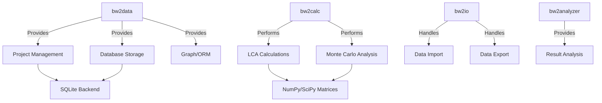

# 🌿 Brightway 2.5 - Comprehensive Reference Guide

> **Document Purpose**: Complete technical reference for implementing Brightway 2.5 LCA capabilities in the Sustain 4.0 BioEngine Streamlit application.
> 
> **Last Updated**: October 30, 2025  
> **Brightway Version**: 2.5  
> **Target Application**: Streamlit-based LCA platform for bioprocesses

---

## 📋 Table of Contents

1. [Executive Summary](#executive-summary)
2. [What is Brightway 2.5?](#what-is-brightway-25)
3. [Core Architecture](#core-architecture)
4. [Installation & Setup](#installation--setup)
5. [Key Concepts & Terminology](#key-concepts--terminology)
6. [Database Management](#database-management)
7. [LCA Calculations](#lca-calculations)
8. [Data Import/Export](#data-importexport)
9. [Integration Strategy for Sustain 4.0](#integration-strategy-for-sustain-40)
10. [Code Examples](#code-examples)
11. [Migration from v2 to v2.5](#migration-from-v2-to-v25)
12. [Common Pitfalls](#common-pitfalls)
13. [Resources](#resources)

---

## 🎯 Executive Summary

**Brightway 2.5** is an open-source Python framework for **Life Cycle Assessment (LCA)** that provides:

- **Matrix-based calculations** for fast LCA computations
- **Project-based data management** with SQLite storage
- **Extensive database support** (ecoinvent, USEEIO, Exiobase, etc.)
- **Uncertainty analysis** via Monte Carlo simulations
- **Impact assessment methods** (IPCC, ReCiPe, etc.)
- **Flexible data import/export** (Ecospold, SimaPro, Excel, JSON)

### Why Brightway for Sustain 4.0?

✅ **Perfect fit for bioprocess LCA** - handles complex multifunctional systems  
✅ **Python-native** - integrates seamlessly with Streamlit  
✅ **Open-source** - no licensing costs, full transparency  
✅ **Active community** - strong academic and industry support  
✅ **Extensible** - can add custom impact categories and data sources

---

## 🌿 What is Brightway 2.5?

### Overview

Brightway is a software framework for Life Cycle Assessment that analyzes environmental impacts across a product's entire lifecycle:

```
RAW MATERIALS → PRODUCTION → USE → END-OF-LIFE → ENVIRONMENTAL IMPACTS
```

### Core Capabilities

| Capability | Description |
|------------|-------------|
| **LCI (Life Cycle Inventory)** | Track all inputs/outputs in product system |
| **LCIA (Impact Assessment)** | Convert flows to environmental impacts |
| **Uncertainty Analysis** | Monte Carlo sampling for statistical confidence |
| **Regionalization** | Location-specific impact factors |
| **Temporal Analysis** | Time-dependent LCA calculations |

### Version Comparison: Brightway 2 vs 2.5

| Component | Brightway 2 | Brightway 2.5 | Key Change |
|-----------|-------------|---------------|------------|
| `bw2data` | < 3.99 | >= 4.0.dev11 | Integer IDs, graph-based storage |
| `bw2calc` | < 1.8.1 | >= 2.0.dev5 | MultiLCA, improved matrix handling |
| `bw2io` | < 0.8.9 | >= 0.9.dev6 | Better import strategies |
| `bw2analyzer` | < 0.10.99 | >= 0.11.1 | Enhanced analysis tools |

**Breaking Changes in 2.5:**
- Activity identifiers now use **integer IDs** instead of tuples
- LCA initialization syntax changed (requires `data_objs`)
- Project structure updated (automatic migration available)

---

## 🏗️ Core Architecture

### Component Overview



### The Four Core Libraries

#### 1. **bw2data** - Data Management
```python
import bw2data as bd

# Project management
bd.projects.set_current('my_project')

# Database access
db = bd.Database('ecoinvent 3.10')

# Node retrieval (new in 2.5)
activity = bd.get_node(id=12345)
```

**Key Features:**
- Project-based data isolation
- SQLite + JSON storage
- Graph-based inventory model
- Search and filtering
- Parameter management

#### 2. **bw2calc** - Calculations Engine
```python
import bw2calc as bc

# Prepare LCA inputs
demand, data_objs, _ = bd.prepare_lca_inputs(
    {my_activity: 1},
    method=('IPCC 2013', 'climate change', 'GWP 100a')
)

# Run LCA
lca = bc.LCA(demand=demand, data_objs=data_objs)
lca.lci()   # Life Cycle Inventory
lca.lcia()  # Life Cycle Impact Assessment
print(lca.score)  # Final impact score
```

**Key Features:**
- Matrix-based calculations ($h = A^{-1}f$)
- Stochastic LCA (Monte Carlo)
- Multi-functional unit analysis (MultiLCA)
- Sparse matrix optimization

#### 3. **bw2io** - Input/Output
```python
import bw2io as bi

# Import ecoinvent database
importer = bi.SingleOutputEcospold2Importer(
    'path/to/ecospold2/files',
    'ei_38_cutoff'
)
importer.apply_strategies()
importer.write_database()
```

**Supported Formats:**
- Ecospold 1 & 2 (ecoinvent)
- SimaPro CSV
- Excel templates
- ILCD XML
- JSON-LD (openLCA)

#### 4. **bw2analyzer** - Result Analysis
```python
from bw2analyzer import ContributionAnalysis

# Analyze top contributors
ca = ContributionAnalysis()
top_emissions = ca.annotated_top_emissions(lca)
```

---

## 💻 Installation & Setup

### Option 1: pip (Recommended for Streamlit)

```bash
# Create virtual environment
python -m venv venv_brightway
source venv_brightway/bin/activate  # Linux/Mac
# or
venv_brightway\Scripts\activate  # Windows

# Install Brightway 2.5
pip install brightway25 pypardiso

# For our Streamlit app, also install:
pip install streamlit pandas plotly
```

### Option 2: conda/mamba

```bash
# Create conda environment
conda create -n brightway -c conda-forge -c cmutel brightway25
conda activate brightway
```

### Initial Setup

```python
import bw2io as bi
import bw2data as bd

# Initialize directories and default data
bi.bw2setup()  # Run once per installation

# Create project for Sustain 4.0
bd.projects.set_current('Sustain40_BioEngine')

# Install biosphere data
bi.remote.install_project(
    'ecoinvent-3.10-biosphere',
    'biosphere3'
)
```

### Verify Installation

```python
import brightway2 as bw2
print(f"Brightway version: {bw2.__version__}")

# Check installed databases
print(bd.databases)
# Output: {}  # Empty initially

# Check available projects
print(list(bd.projects))
```

---

## 📚 Key Concepts & Terminology

### LCA Fundamentals

| Term | Brightway Name | ISO Term | Description |
|------|----------------|----------|-------------|
| **Activity** | `activity` | `unit process` | A process or elementary flow |
| **Product** | `product` | `product` | What an activity produces |
| **Exchange** | `technosphere exchange` | `intermediate flow` | Link between activities |
| **Emission** | `biosphere exchange` | `elementary flow` | Environmental interaction |
| **Method** | `method` | `impact category` | LCIA characterization factors |
| **Functional Unit** | `demand` | `functional unit` | System requirement for calculation |

### Project Structure

```
Brightway Projects/
└── Sustain40_BioEngine/           # Your project
    ├── project.db                  # SQLite database (metadata)
    ├── databases/                  # Database storage
    │   ├── biosphere3.db
    │   ├── ecoinvent_38.db
    │   └── my_bioprocess.db
    └── intermediate/               # Cached matrices
```

### Graph Model

Brightway uses a **directed graph** to represent LCA systems:

```python
# Nodes = Activities/Products/Flows
node_types = [
    'process',                    # Production process
    'product',                    # Intermediate product
    'emission',                   # Biosphere flow
    'multifunctional',            # Process with multiple outputs
]

# Edges = Exchanges
edge_types = [
    'production',                 # Output of process
    'technosphere',               # Input from another process
    'biosphere',                  # Environmental exchange
    'substitution',               # Avoided product
]
```

### Matrix Representation

```
Technosphere Matrix (A):  [processes × products]
Biosphere Matrix (B):     [emissions × processes]
Characterization (C):     [impacts × emissions]

Supply Vector (s):        A^(-1) × demand
Inventory (g):            B × s
Impact Score:             C × g
```

### Functional Unit

The **demand** in Brightway 2.5 is expressed as a dictionary:

```python
# Single product
demand = {activity_node.id: 1}  # 1 unit of activity

# Multiple products (co-production)
demand = {
    product_a.id: 10,   # 10 kg of product A
    product_b.id: 5     # 5 L of product B
}
```

---

## 🗄️ Database Management

### Creating a Database

```python
import bw2data as bd

# Create new database
db = bd.Database('my_bioprocess_db')
db.register()  # Save metadata

# Add activities
db.write({
    ('my_bioprocess_db', 'fermentation'): {
        'name': 'Ethanol fermentation',
        'unit': 'kg',
        'location': 'BR',
        'type': 'process',
        'exchanges': [
            {
                'input': ('my_bioprocess_db', 'fermentation'),
                'amount': 1,
                'type': 'production'
            },
            {
                'input': ('biosphere3', 'CO2_emission'),
                'amount': 0.5,
                'type': 'biosphere'
            }
        ]
    }
})
```

### Querying Databases

```python
# List all databases
sorted(bd.databases)

# Check if database exists
'ecoinvent 3.10' in bd.databases

# Get database size
db = bd.Database('ecoinvent 3.10')
len(db)  # Number of activities

# Search database
results = db.search('electricity')
for act in results:
    print(act['name'], act['location'])

# Get random activity (for testing)
random_act = db.random()
```

### Working with Nodes

```python
# Get node by ID (new in 2.5)
node = bd.get_node(id=12345)

# Get node by name and location
nodes = db.search('electricity', filter={'location': 'BR'})
electricity_br = nodes[0]

# Access node attributes
print(node['name'])
print(node['unit'])
print(node['location'])
print(node.id)  # Integer ID (new in 2.5)

# Iterate through exchanges
for exc in node.exchanges():
    print(exc['input'], exc['amount'], exc['type'])
```

### Database Operations

```python
# Copy database
db_copy = bd.Database('ecoinvent 3.10').copy('ecoinvent_modified')

# Rename database
db.rename('new_name')

# Delete database
del bd.databases['old_database']

# Get database metadata
db.metadata
# {'backend': 'sqlite', 'depends': ['biosphere3'], ...}
```

---

## 🧮 LCA Calculations

### Basic LCA Workflow

```python
import bw2data as bd
import bw2calc as bc

# 1. Select functional unit
my_process = bd.Database('my_db').get('process_code')
functional_unit = {my_process.id: 1}  # 1 unit

# 2. Select impact method
method = ('IPCC 2013', 'climate change', 'GWP 100a')

# 3. Prepare calculation inputs
demand, data_objs, _ = bd.prepare_lca_inputs(
    functional_unit,
    method=method
)

# 4. Run LCA
lca = bc.LCA(demand=demand, data_objs=data_objs)
lca.lci()   # Calculate inventory
lca.lcia()  # Calculate impacts

# 5. Get results
print(f"GWP 100a: {lca.score:.2f} kg CO2-eq")
```

### Monte Carlo Uncertainty Analysis

```python
# Enable stochastic calculations
lca_stochastic = bc.LCA(
    demand=demand,
    data_objs=data_objs,
    use_distributions=True  # Sample from uncertainty distributions
)

# Run 1000 iterations
results = []
for _ in range(1000):
    next(lca_stochastic)  # Generate new sample
    lca_stochastic.lci()
    lca_stochastic.lcia()
    results.append(lca_stochastic.score)

# Statistical analysis
import numpy as np
print(f"Mean: {np.mean(results):.2f}")
print(f"Std Dev: {np.std(results):.2f}")
print(f"95% CI: [{np.percentile(results, 2.5):.2f}, {np.percentile(results, 97.5):.2f}]")
```

### Multi-Functional Unit Analysis (MultiLCA)

```python
# Define multiple functional units
functional_units = {
    "Scenario A": {product_1.id: 10},
    "Scenario B": {product_2.id: 5},
    "Scenario C": {product_1.id: 5, product_2.id: 2.5}  # Combined
}

# Define multiple impact methods
method_config = bd.MethodConfig(
    impact_categories=[
        ('IPCC 2013', 'climate change', 'GWP 100a'),
        ('ReCiPe 2016', 'water use', 'total'),
        ('ReCiPe 2016', 'land use', 'total')
    ]
)

# Prepare data
data_objs = bd.get_multilca_data_objs(functional_units, method_config)

# Run MultiLCA
mlca = bc.MultiLCA(
    demands=functional_units,
    method_config=method_config,
    data_objs=data_objs
)
mlca.lci()
mlca.lcia()

# Access results
mlca.scores
# {
#   (('IPCC 2013', 'climate change', 'GWP 100a'), 'Scenario A'): 123.4,
#   (('IPCC 2013', 'climate change', 'GWP 100a'), 'Scenario B'): 45.6,
#   ...
# }
```

### Contribution Analysis

```python
# Get supply vector (activity production amounts)
supply = lca.supply_array

# Get characterized inventory matrix
characterized_inv = lca.characterized_inventory

# Find top contributing activities
from bw2analyzer import ContributionAnalysis
ca = ContributionAnalysis()

# Top 10 processes
top_processes = ca.annotated_top_processes(lca, limit=10)
for process, score, percentage in top_processes:
    print(f"{process}: {score:.2f} ({percentage:.1f}%)")

# Top 10 emissions
top_emissions = ca.annotated_top_emissions(lca, limit=10)
```

### Result Visualization

```python
# Convert results to DataFrame
df = lca.to_dataframe(matrix_label="characterized_inventory")

# Plot with plotly (for Streamlit integration)
import plotly.express as px

fig = px.bar(
    df.nlargest(10, 'amount'),
    x='activity',
    y='amount',
    title='Top 10 Contributing Processes'
)
fig.show()  # or st.plotly_chart(fig) in Streamlit
```

---

## 📥 Data Import/Export

### Importing ecoinvent

```python
import bw2io as bi

# Method 1: From local files
importer = bi.SingleOutputEcospold2Importer(
    dirpath='/path/to/ecoinvent_38_cutoff',
    db_name='ecoinvent_38_cutoff'
)

# Apply standard processing strategies
importer.apply_strategies()

# Check for unlinked exchanges
print(importer.statistics())
# (19565 datasets, 629959 exchanges, 0 unlinked exchanges)

# Write to database
if importer.statistics()[2] == 0:
    importer.write_database()
else:
    print("❌ Unlinked exchanges found!")
    importer.write_excel('unlinked_report.xlsx')
```

### Importing SimaPro CSV

```python
# Import SimaPro CSV file
importer = bi.SimaProCSVImporter(
    filepath='path/to/simapro_export.csv',
    db_name='my_simapro_data'
)
importer.apply_strategies()
importer.match_database('biosphere3')  # Link to biosphere
importer.write_database()
```

### Excel Import (Custom Data)

**Excel Template Structure:**
```
| Project parameters (optional) |
| param1 | param2 | param3 |
| value1 | value2 | value3 |

| Database | my_bioprocess_db |
| description | Bioprocess LCA data |

| Activity | Ethanol fermentation |
| name | Ethanol fermentation |
| unit | kg |
| location | BR |

| Exchanges |
| name | amount | unit | type | input_database | input_code |
| Glucose | 1.8 | kg | technosphere | biosphere3 | glucose_code |
| CO2 | 0.5 | kg | biosphere | biosphere3 | co2_emission_code |
| Ethanol | 1.0 | kg | production | my_bioprocess_db | ethanol_code |
```

```python
# Import from Excel
importer = bi.ExcelImporter('my_data.xlsx')
importer.apply_strategies()
importer.match_database('biosphere3')
importer.write_database()
```

### Exporting Data

```python
# Export to Excel
from bw2io.export import DatabaseExport

exporter = DatabaseExport('my_bioprocess_db')
exporter.write_excel('exported_db.xlsx')

# Export as dictionary (for JSON)
db = bd.Database('my_bioprocess_db')
data_dict = db.relabel_data(db.load())

import json
with open('exported_db.json', 'w') as f:
    json.dump(data_dict, f, indent=2)
```

---

## 🔗 Integration Strategy for Sustain 4.0

### Architecture Recommendation

```
┌─────────────────────────────────────────────┐
│         Streamlit Frontend (UI)             │
│  - Project creation forms                   │
│  - LCA configuration                        │
│  - Results visualization                    │
└──────────────────┬──────────────────────────┘
                   │
                   ▼
┌─────────────────────────────────────────────┐
│       Brightway Integration Layer           │
│  (NEW - to be developed)                    │
│  - Project ↔ Brightway project mapping      │
│  - Database management                      │
│  - LCA calculation wrapper                  │
│  - Result processing                        │
└──────────────────┬──────────────────────────┘
                   │
                   ▼
┌─────────────────────────────────────────────┐
│          Existing Utils (utils.py)          │
│  - Session state management                 │
│  - JSON persistence                         │
│  - PDF generation                           │
└─────────────────────────────────────────────┘
```

### Implementation Phases

#### Phase 1: Foundation (Weeks 1-2)
- [ ] Install Brightway 2.5 in project environment
- [ ] Create `brightway_wrapper.py` module
- [ ] Initialize Brightway projects per user
- [ ] Map Sustain 4.0 projects to Brightway databases

#### Phase 2: Data Input (Weeks 3-4)
- [ ] Create UI for process definition
- [ ] Build exchange input forms
- [ ] Link to biosphere flows
- [ ] Validate user input

#### Phase 3: Calculations (Weeks 5-6)
- [ ] Implement LCI calculation
- [ ] Implement LCIA with method selection
- [ ] Add uncertainty analysis
- [ ] Generate result matrices

#### Phase 4: Visualization (Weeks 7-8)
- [ ] Process contribution charts
- [ ] Impact breakdown plots
- [ ] Comparison dashboards
- [ ] PDF export with results

### Code Template: `brightway_wrapper.py`

```python
"""
Brightway 2.5 Integration for Sustain 4.0 BioEngine
Provides wrapper functions for seamless LCA calculations
"""

import bw2data as bd
import bw2calc as bc
import bw2io as bi
from pathlib import Path
import streamlit as st

class BrightwayManager:
    """Manages Brightway integration for Sustain 4.0"""
    
    def __init__(self, user_id: str):
        self.user_id = user_id
        self.project_name = f"sustain40_{user_id}"
        self._ensure_project()
    
    def _ensure_project(self):
        """Initialize Brightway project for user"""
        if self.project_name not in list(bd.projects):
            bd.projects.set_current(self.project_name)
            bi.bw2setup()  # Initialize biosphere
        else:
            bd.projects.set_current(self.project_name)
    
    def create_bioprocess_database(self, project_data: dict) -> str:
        """
        Create a Brightway database from Sustain 4.0 project data
        
        Args:
            project_data: Project dict from st.session_state
        
        Returns:
            Database name
        """
        db_name = f"bioprocess_{project_data['key_code']}"
        
        if db_name in bd.databases:
            return db_name  # Already exists
        
        db = bd.Database(db_name)
        db.write({
            (db_name, 'main_process'): {
                'name': project_data['name'],
                'unit': project_data.get('reference_flow_unit', 'kg'),
                'location': project_data.get('region', 'GLO'),
                'type': 'process',
                'exchanges': []  # To be populated
            }
        })
        
        return db_name
    
    def run_lca(
        self,
        db_name: str,
        activity_code: str,
        method: tuple,
        amount: float = 1
    ) -> dict:
        """
        Perform LCA calculation
        
        Returns:
            {
                'score': float,
                'unit': str,
                'method': str,
                'supply_vector': list,
                'top_processes': list
            }
        """
        # Get activity
        activity = bd.Database(db_name).get(activity_code)
        
        # Prepare LCA
        demand, data_objs, _ = bd.prepare_lca_inputs(
            {activity.id: amount},
            method=method
        )
        
        # Calculate
        lca = bc.LCA(demand=demand, data_objs=data_objs)
        lca.lci()
        lca.lcia()
        
        # Process results
        results = {
            'score': lca.score,
            'unit': bd.Method(method).metadata.get('unit', 'unknown'),
            'method': ' '.join(method),
            'supply_vector': lca.supply_array.tolist(),
            'top_processes': self._get_top_contributors(lca)
        }
        
        return results
    
    def _get_top_contributors(self, lca, limit=10):
        """Extract top contributing processes"""
        from bw2analyzer import ContributionAnalysis
        ca = ContributionAnalysis()
        return ca.annotated_top_processes(lca, limit=limit)
    
    @staticmethod
    @st.cache_data
    def get_available_methods():
        """Get list of available impact methods"""
        return sorted(bd.methods)

# Usage example in Streamlit
def streamlit_integration_example():
    """Example of using BrightwayManager in Streamlit"""
    
    if 'brightway_manager' not in st.session_state:
        st.session_state.brightway_manager = BrightwayManager(
            user_id=st.session_state.username
        )
    
    manager = st.session_state.brightway_manager
    
    # Create database from project
    if st.button("Initialize LCA Database"):
        project = st.session_state.current_project
        db_name = manager.create_bioprocess_database(project)
        st.success(f"✅ Database created: {db_name}")
    
    # Run LCA
    if st.button("Calculate Impact"):
        method = ('IPCC 2013', 'climate change', 'GWP 100a')
        results = manager.run_lca(
            db_name='bioprocess_12345',
            activity_code='main_process',
            method=method
        )
        
        st.metric(
            label=f"{results['method']}",
            value=f"{results['score']:.2f} {results['unit']}"
        )
```

### Session State Management

```python
# Add to utils.py
def init_brightway_session_state():
    """Initialize Brightway-related session state variables"""
    if 'brightway_initialized' not in st.session_state:
        st.session_state.brightway_initialized = False
    if 'lca_results' not in st.session_state:
        st.session_state.lca_results = {}
    if 'impact_methods' not in st.session_state:
        st.session_state.impact_methods = []
```

---

## 💡 Code Examples

### Example 1: Complete LCA from Scratch

```python
import bw2data as bd
import bw2calc as bc
import bw2io as bi

# Setup
bi.bw2setup()
bd.projects.set_current('example_project')

# Create simple database
db = bd.Database('simple_bioethanol')
db.write({
    ('simple_bioethanol', 'ethanol_production'): {
        'name': 'Ethanol from sugarcane',
        'unit': 'kg',
        'location': 'BR',
        'type': 'process',
        'exchanges': [
            {
                'input': ('simple_bioethanol', 'ethanol_production'),
                'amount': 1,
                'type': 'production'
            },
            {
                'input': ('biosphere3', ('natural resource', 'in ground', 'Biomass')),
                'amount': 2.5,
                'type': 'biosphere',
                'name': 'Sugarcane biomass'
            },
            {
                'input': ('biosphere3', ('air', 'non-urban air or from high stacks', 'Carbon dioxide, fossil')),
                'amount': 0.8,
                'type': 'biosphere'
            }
        ]
    }
})

# Run LCA
ethanol = bd.Database('simple_bioethanol').get('ethanol_production')
method = ('IPCC 2013', 'climate change', 'GWP 100a')

demand, data_objs, _ = bd.prepare_lca_inputs({ethanol.id: 1}, method=method)
lca = bc.LCA(demand=demand, data_objs=data_objs)
lca.lci()
lca.lcia()

print(f"Carbon footprint: {lca.score:.2f} kg CO2-eq/kg ethanol")
```

### Example 2: Importing Custom Excel Data

```python
# Create Excel file first (see template above)
import pandas as pd

# Then import
importer = bi.ExcelImporter('bioprocess_data.xlsx')
importer.apply_strategies()
importer.match_database('biosphere3', fields=['name', 'unit'])

# Check for unlinked
stats = importer.statistics()
if stats[2] > 0:
    print(f"⚠️ {stats[2]} unlinked exchanges")
    importer.write_excel('unlinked_report.xlsx')
else:
    importer.write_database()
    print("✅ Database imported successfully")
```

### Example 3: Scenario Comparison

```python
# Define scenarios
scenarios = {
    "Current Process": {
        "Glucose consumption": 1.8,
        "Energy input": 2.5
    },
    "Optimized Process": {
        "Glucose consumption": 1.5,
        "Energy input": 2.0
    }
}

# Run comparisons
results = {}
for scenario_name, params in scenarios.items():
    # Modify database based on scenario
    # ... (update exchange amounts)
    
    # Run LCA
    lca = bc.LCA(demand=demand, data_objs=data_objs)
    lca.lci()
    lca.lcia()
    
    results[scenario_name] = lca.score

# Visualize with Plotly
import plotly.graph_objects as go

fig = go.Figure(data=[
    go.Bar(
        x=list(results.keys()),
        y=list(results.values()),
        text=[f"{v:.2f}" for v in results.values()],
        textposition='auto'
    )
])
fig.update_layout(
    title="Scenario Comparison: Carbon Footprint",
    yaxis_title="kg CO2-eq",
    showlegend=False
)
```

---

## 🔄 Migration from v2 to v2.5

### Automatic Migration

```python
import bw2data as bd

# Migrate project
bd.projects.set_current('old_project_name')
bd.projects.migrate_project_25()
```

### Key API Changes

| Brightway 2 | Brightway 2.5 | Notes |
|-------------|---------------|-------|
| `activity.key` | `activity.id` | Now returns integer |
| `LCA({act: 1}, method=m)` | `LCA(demand, data_objs)` | Must use `prepare_lca_inputs` |
| `activity['database']` | `activity.database` | Property access |
| `Database('db').get('code')` | `Database('db').get(id)` | Use integer ID |

### Code Migration Example

**Before (v2):**
```python
activity = bw2.Database('ei').get('electricity_code')
lca = bw2.LCA({activity: 1}, method=('IPCC', 'GWP'))
lca.lci()
```

**After (v2.5):**
```python
activity = bd.Database('ei').search('electricity')[0]
demand, data_objs, _ = bd.prepare_lca_inputs(
    {activity.id: 1},
    method=('IPCC', 'GWP')
)
lca = bc.LCA(demand=demand, data_objs=data_objs)
lca.lci()
```

---

## ⚠️ Common Pitfalls

### 1. **Forgetting to Set Project**
```python
# ❌ Wrong - will use default project
db = bd.Database('my_db')

# ✅ Correct - always set project first
bd.projects.set_current('my_project')
db = bd.Database('my_db')
```

### 2. **Using Old-Style Activity Keys**
```python
# ❌ Wrong in 2.5
activity = db.get(('database', 'code'))

# ✅ Correct in 2.5
activity = bd.get_node(id=12345)
# or
activity = db.search('name')[0]
```

### 3. **Not Checking Unlinked Exchanges**
```python
# ❌ Wrong - may write broken database
importer.write_database()

# ✅ Correct - check first
if importer.statistics()[2] == 0:
    importer.write_database()
else:
    print("Fix unlinked exchanges first!")
    importer.write_excel('report.xlsx')
```

### 4. **Forgetting Data Objects**
```python
# ❌ Wrong in 2.5
lca = bc.LCA({act.id: 1}, method=method)

# ✅ Correct
demand, data_objs, _ = bd.prepare_lca_inputs({act.id: 1}, method=method)
lca = bc.LCA(demand=demand, data_objs=data_objs)
```

### 5. **Not Handling Large Imports**
```python
# ❌ May timeout/crash for large databases
importer.write_database()

# ✅ Better - show progress
from tqdm import tqdm
importer.write_database(progress=True)
```

---

## 📚 Resources

### Official Documentation
- **Main Docs**: https://docs.brightway.dev/
- **Learn (Tutorials)**: https://learn.brightway.dev/
- **Live Demo**: https://docs.brightway.dev/projects/live
- **API Reference**: https://docs.brightway.dev/api/

### Community
- **GitHub Organization**: https://github.com/brightway-lca
- **Discussions**: https://github.com/brightway-lca/brightway2/discussions
- **Mailing List**: brightway-lca@googlegroups.com

### Key Repositories
- **brightway2-data**: https://github.com/brightway-lca/brightway2-data
- **brightway2-calc**: https://github.com/brightway-lca/brightway2-calc
- **brightway2-io**: https://github.com/brightway-lca/brightway2-io
- **brightway-documentation**: https://github.com/brightway-lca/brightway-documentation

### Related Tools
- **Activity Browser**: GUI for Brightway (https://github.com/LCA-ActivityBrowser/activity-browser)
- **Wurst**: Data manipulation (https://github.com/polca/wurst)
- **Premise**: Prospective LCA (https://github.com/polca/premise)
- **bw2analyzer**: Result analysis (part of core)

### Academic Papers
- Mutel, C. (2017). Brightway: An open source framework for Life Cycle Assessment. *Journal of Open Source Software*, 2(12), 236. https://doi.org/10.21105/joss.00236

### Ecoinvent Access
- **Ecoinvent Website**: https://ecoinvent.org/
- **License Required**: Academic or commercial
- **Version Compatibility**: 3.6+ recommended for Brightway 2.5

---

## 🎯 Next Steps for Implementation

### Immediate Actions (This Week)

1. **Install Brightway 2.5 in dev environment**
   ```bash
   pip install brightway25 pypardiso
   ```

2. **Create test project**
   ```python
   import bw2io as bi
   bi.bw2setup()
   ```

3. **Explore example data**
   ```python
   bd.projects.set_current('test')
   bi.remote.install_project('USEEIO-1.1', 'useeio_test')
   ```

### Short-term Goals (Next 2 Weeks)

- [ ] Design `brightway_wrapper.py` architecture
- [ ] Map Sustain 4.0 project fields → Brightway nodes
- [ ] Create UI mockup for LCI data entry
- [ ] Test basic LCA calculation workflow

### Medium-term Goals (Next Month)

- [ ] Implement database creation from user projects
- [ ] Add impact method selection UI
- [ ] Build result visualization components
- [ ] Integrate with existing PDF export

### Long-term Vision (3+ Months)

- [ ] Full AESA (Absolute Environmental Sustainability Assessment) integration
- [ ] Real-time data ingestion from IoT sensors
- [ ] Machine learning for LCI gap filling
- [ ] Collaborative project sharing

---

## 📝 Notes for Developers

### Things to Remember

1. **Always set project before operations**
   ```python
   bd.projects.set_current('your_project')
   ```

2. **Integer IDs are the new standard**
   - Activities, products, flows now use integer IDs
   - Old tuple keys still work but are deprecated

3. **Data objects are required for LCA**
   - Can't instantiate LCA directly with method anymore
   - Must use `bd.prepare_lca_inputs()`

4. **Database writes are atomic**
   - Either all data writes or none
   - Use transactions for safety

5. **Matrices are sparse**
   - Use appropriate scipy functions
   - Don't convert to dense unless necessary

### Performance Tips

- Cache database queries with `@st.cache_data`
- Reuse LCA objects for parameter variations
- Use MultiLCA for batch calculations
- Precompute matrices when possible

### Security Considerations

- User projects are isolated by design
- No SQL injection risk (uses ORM)
- Validate all user input before database writes
- Consider backup strategy for project data

---

**End of Document**

*For questions or contributions to this guide, contact the Sustain 4.0 development team or refer to Brightway's official documentation.*
